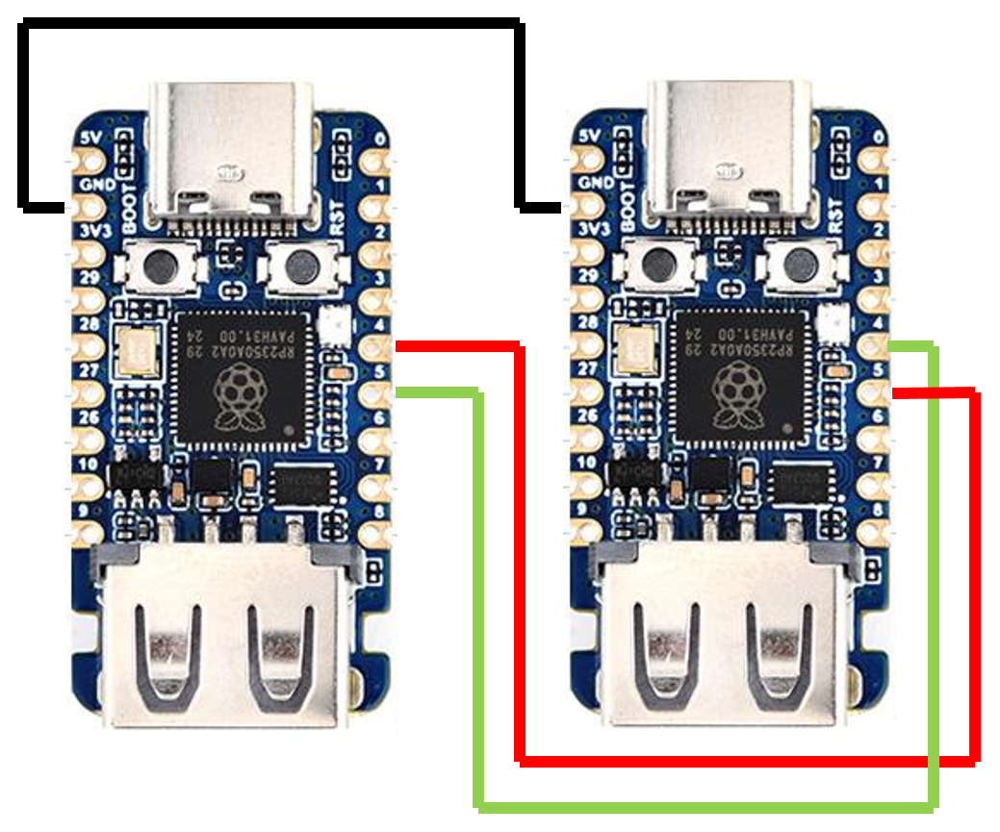

# USB HID Switcher

高度なUSB HID切り替え装置です。二個のRaspberry Pi Picoを使用して、複数のPCを切り替えながらUSB Keyboardやマウス操作ができます。
Advanced USB HID switching device. Uses two Raspberry Pi Picos to enable USB keyboard and mouse operation while switching between multiple PCs.

## 使い方

### 配線

二台のRP2350-USB-Aを下記の通り接続します



### 初期セットアップ

#### 1. ファームウェアの書き込み

1. **BOOTSELモード**でPicoをPCに接続します
   - BOOTSELボタンを押しながらUSBケーブルを接続
   - PicoがRPI-RP2ドライブとして認識されます

2. **ファームウェアファイルのコピー**
   ```bash
   # ビルドしたuf2ファイルをPicoにコピー
   cp build/usb_hid_switcher/usb_hid_switcher.uf2 /media/RPI-RP2/
   ```
   
3. **自動再起動**
   - ファイルコピー完了後、Picoが自動的に再起動します
   - USB HID SwitcherとしてPCに認識されます

#### 2. 切り替え操作

以下のキー操作でPC間の切り替えが可能です：

- **CapsLock + M**: PC1（SWITCH 0）に切り替え
- **CapsLock + N**: PC2（SWITCH 1）に切り替え

## 主な機能

### 🔄 **デュアルUSBモード**
- **USB Host**: 複数のUSB HIDデバイスを同時接続、USB Hubの使用も可能
- **USB Device**: キーボード、マウス、ゲームパッドとしてPCに認識

### 🎮 **対応デバイス**
- **キーボード**: BOOTプロトコル、REPORTプロトコル対応
- **マウス**: 16bit高精度、ホイール・パン操作対応

### 📡 **通信インターフェース**
- **CDC (Virtual COM Port)**: USB経由でPCから仮想COMポートとして認識され、設定やコマンド送信が可能
- **UART0**: デバッグ出力
- **UART1**: Pico間通信
- **File System**: LittleFSによる設定・スクリプト保存

### 🔧 **高度な機能**
- デバイス別プロファイル設定
- メタキー機能（キー組み合わせの動的変更）

## ハードウェア構成

### ピン配置

#### Pico2 (RP2350)
```
GPIO 12-13 : USB Host (D+/D-)
GPIO 16    : WS2812 RGB LED
GPIO 4-5   : UART1
GPIO 0-1   : UART0 (デバッグ/通信)
GPIO 26    : I2C1 SDA (OLED Display)
GPIO 27    : I2C1 SCL (OLED Display)
```

## ビルド方法

### 1. 依存関係
```bash
# Pico SDK (v1.5.0以降推奨)
export PICO_SDK_PATH=/path/to/pico-sdk

# 必要なツール
sudo apt install cmake gcc-arm-none-eabi build-essential
```

### 2. ビルド手順
```bash
# プロジェクトディレクトリに移動
cd USB_Switcher
mkdir build && cd build
cmake .. -DPICO_BOARD=pico2 -DPICO_SDK_PATH=$PICO_SDK_PATH
# ビルド実行
make
```

### 3. ファームウェア書き込み
```bash
# BOOTSELモードでPicoを接続後
cp usb_switcher/usb_switcher.uf2 /media/RPI-RP2/
```

## LED状態表示

| 色 | 状態 |
|---|---|
| 🟡 黄 | 別Picoへ信号転送中（UART経由出力） |
| 🟢 緑 | アクティブ |
| 点滅 | アクティブ状態（入力処理中） |

## 対応デバイス例

### マウス
- Logicool G300s (046d:c246)
- Logicool Unified Receiver (046d:c52b)
- 各種ゲーミングマウス

### キーボード
- 標準USBキーボード

## ライセンス

このプロジェクトはMITライセンスです。各コンポーネントのライセンスは各コンポーネントのライセンスファイルを参照してください。

## コントリビューション

バグ報告や機能提案はIssueでお願いします。プルリクエストも歓迎します。

## 関連リンク

- [Pico-PIO-USB](https://github.com/sekigon-gonnoc/Pico-PIO-USB)
- [Raspberry Pi Pico SDK](https://github.com/raspberrypi/pico-sdk)
- [TinyUSB](https://github.com/hathach/tinyusb)
- [FreeRTOS](https://www.freertos.org/)
- [LittleFS](https://github.com/littlefs-project/littlefs)
- [Lua](https://www.lua.org/)