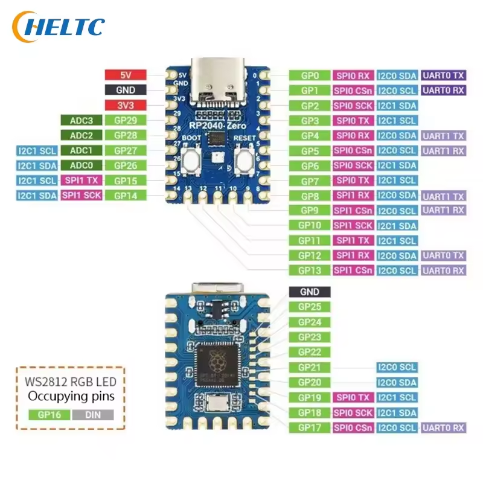
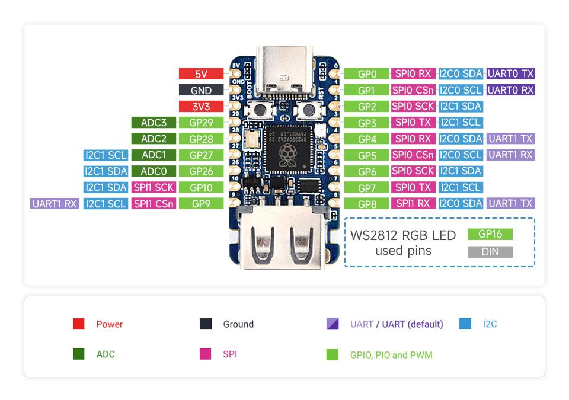

# pin information

pi pico rp2040 zero

pin 16 full color LED
pin 9   
    10  
    11  
    12  

# pi pico rp 2350 usb a

12
13

cd build
cd ..
rm -rf build
mkdir build
cd build
cmake .. -DPICO_BOARD=pico

cmake .. -DPICO_BOARD=pico2

cmake .. -DPICO_BOARD=pico

# TODO

            LCD対応
    Pad対応
変換送信update
マウス16bit化

git clone https://github.com/ypsitau/pico-jxglib.git
cd pico-jxglib
git submodule update --init

変更を破棄して、github リポジトリの最新ファイルまで戻してください。

------------------------------
prog MOUSE-046d:c52b
# Logicool Unified Receiver
PROTOCOL REPORT
ReportID 02
BUTTON 1 0 16
X      3 0 12
Y      4 4 12
WHEEL  6 0 8
PAN    7 0 8

------------------------------
prog MOUSE-046d:c246
# Logicool G300s
PROTOCOL REPORT
ReportID FFFF
BUTTON 0 0 16
X      2 0 16
Y      4 0 16
WHEEL  6 0 8
PAN    7 0 8

------------------------------
prog config
PROTOCOL=REPORT

------------------------------
prog config
PROTOCOL=BOOT

------------------------------
prog autorun.lua
print("Hello")

------------------------------
prog Meta-A
type("Hello HID Switcher.\n", 10)

type("Hello HID Switcher.")

------------------------------
Pico間通信Protocolの例
例えばAキーを押したときは、
ヘッダ = !K
base64コード 0x04

Aキーを離したときは、
ヘッダ = !k
base64コード 0x04

Metaキー
ヘッダ = !A
base64コード メタキーの1バイトコード

全部離した
ヘッダ = !O

マウスボタン
!B
base64コード マウスの押されているキー(1byte)

マウスXY
ヘッダ = !X
base64コード X Y (各一バイト)

マウスwheel, plan
マウスXY
ヘッダ = !W
base64コード Wheel Pan (各一バイト)
